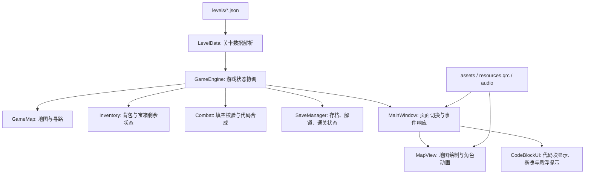

# CompileTheSpire 项目期末报告

组长：冯子涵

组员：张然博、陈骏坤

## 1. 程序功能介绍

### 1.1 项目目标与实际问题

`CompileTheSpire` 是一个基于 C++17 与 Qt Widgets 开发的元学习类桌面游戏项目。项目将 C++ 程序设计训练中的“根据调用代码、输入输出与局部线索反推函数或类的正确实现”转化为探索、收集、填空与闯关的游戏流程。其核心目标不是单纯提供题目答案，而是通过游戏化交互帮助玩家理解 C++ 代码片段之间的接口关系、函数行为、对象设计和边界条件。

从代码结构看，项目采用关卡 JSON 数据驱动：每个关卡定义地图、宝箱、代码块、线索、普通怪物与 Boss 模板。玩家在地图上探索，收集有限容量背包中的代码块，并把代码块拖入怪物或 Boss 的模板空位中。系统根据关卡预设的匹配规则判断填入是否正确，成功后合成更高层次的函数、类或 Boss 代码块，最终完成关卡。

### 1.2 主要功能点

| 功能类别 | 主要内容 | 对应实现 |
|---|---|---|
| 关卡加载 | 从 `levels` 目录和 `level_list.txt` 按顺序加载普通关卡与 EX 关卡 | `LevelData`、`LoadDirectory`、`MainWindow::loadLevels` |
| 关卡选择 | 显示普通/EX 关卡、分页、锁定/已通关状态 | `stagecatalog`、`SaveManager`、`mainwindow_levelselect.cpp` |
| 地图探索 | 键盘或鼠标移动，显示路径、角色动画、墙体、宝箱、线索、怪物与 Boss | `GameMap`、`MapView`、`mainwindow_gameplay.cpp` |
| 背包系统 | 记录已收集代码块，限制容量，支持丢弃部分代码块 | `Inventory`、`showBagDialog` |
| 宝箱交互 | 支持强制拾取、可跳过、可重复、整包拾取等行为 | `Chest`、`GameEngine::takeFromChest`、`handleChest` |
| 线索系统 | 地图上拾取线索，战斗模板中未解锁线索隐藏显示 | `Clue`、`GameEngine::revealClue`、`handleMonster` |
| 战斗/填空 | 将代码模板中的 `$space$` 渲染为可拖拽填空槽，将代码块填入并校验 | `Combat`、`CodeBlockIcon`、`CodeDropSlot` |
| 代码合成 | 普通怪物战斗成功后合成函数/类代码块，作为 Boss 战素材 | `Combat::synthesize`、`GameEngine::submitCombat` |
| 存档与解锁 | 保存关卡解锁和通关状态，通关后解锁下一关 | `SaveManager` |
| 音画表现 | 背景图、地图绘制、角色精灵动画、音效与背景音乐 | `resources.qrc`、`assets`、`MapView`、`MainWindow` |

### 1.3 用户使用流程

用户启动程序后进入主菜单，点击开始游戏进入关卡选择界面。已解锁关卡可以直接选择，未解锁关卡需要完成前置关卡后才能进入。进入关卡后，玩家通过方向键、WASD 或鼠标点击可达格子进行移动。

在探索过程中，玩家会遇到以下交互对象：

1. 宝箱：提供若干代码块，玩家根据背包容量和题目需要选择拾取。
2. 线索：提供 `main` 函数片段、调用方式、输入输出或语义提示。
3. 普通怪物：展示局部函数/类代码模板，玩家拖拽背包中的代码块填入空位。
4. Boss：通常要求组合已经合成的函数或类代码块，完成整体程序结构。

如果普通战斗填空成功，系统会消耗被使用的代码块，并生成一个新的函数/类代码块放回背包。若 Boss 战成功，当前关卡被标记为通关并保存进度，随后解锁下一关。

## 2. 项目各模块与类设计细节

### 2.1 整体架构

项目整体上可以分为五层：数据层、状态逻辑层、交互控制层、展示层和资源/构建层。

这种设计的优点是游戏内容与程序逻辑有较明显的分离。新增关卡主要依赖 JSON 文件，不需要直接改动地图、背包或战斗逻辑；界面层通过 `GameEngine` 的信号接收状态变化，从而降低 UI 与底层状态机之间的直接耦合。

### 2.2 数据层：`LevelData` 与关卡 JSON

`LevelData` 是项目的数据模型核心，负责把 JSON 文件解析为 C++ 对象。主要结构包括：

- `Space`：表示一个模板空位，包含 `spaceId`、匹配类型和合法值列表。匹配类型包括 `regex`、`prefix`、`find`、`match`。
- `Monster`：表示普通怪物，记录位置、图片、昵称、代码模板、空位列表以及模板引用的线索。
- `Boss`：继承自 `Monster`，额外保存输入输出样例。
- `CodeBlock`：表示可收集、可填入的代码块，包含编号、代码文本和类型。
- `Chest`：表示宝箱，记录位置、是否强制拾取、是否可重复以及内部代码块。
- `Clue`：表示线索文本及其地图位置。
- `Synthesis` 与 `SynthesisCell`：用于拆解代码模板中的 `$clueId$` 和 `$spaceId$` token。

`LevelData::LoadFromJson` 完成 JSON 解析工作。它会读取地图尺寸、背包容量、特殊标签、地图网格、线索、宝箱、怪物和 Boss，并根据 `map_grid` 反向确定各对象在地图中的坐标。`LoadDirectory` 支持按目录扫描或按 `level_list.txt` 指定顺序加载，从而保证正式关卡与 EX 关卡顺序可控。

`templateBreakdown` 是数据层中较关键的工具函数。它扫描代码模板中的 `$...$` 标记，将普通文本与动态单元拆分开，并记录某些独占行 token 的缩进信息。该信息后续被战斗界面用于正确渲染多行线索或代码块。

### 2.3 游戏状态协调：`GameEngine`

`GameEngine` 是项目的核心协调器。它持有当前关卡、地图、背包、战斗对象和存档管理器，并通过 Qt 信号把状态变化通知 UI。

主要职责如下：

- 初始化游戏数据：`gameInit` 调用关卡加载函数，并初始化/读取存档。
- 列出关卡状态：`levelList` 将 `LevelData` 与存档中的解锁、通关状态合并为 `LevelMeta`。
- 开始关卡：`startLevel` 创建新的 `Inventory` 和 `GameMap`，重置快照栈。
- 移动与事件触发：`moveTo` 调用 `GameMap` 寻路和移动，随后根据格子类型触发线索、宝箱、普通怪物或 Boss 事件。
- 宝箱操作：`takeFromChest`、`takeBundleFromChest`、`exitChest` 控制代码块拾取、强制宝箱回退等逻辑。
- 战斗操作：`fillSpace`、`unfillSpace`、`submitCombat` 负责把背包代码块转交给 `Combat`，并处理战斗结果。
- 撤销与重置：通过 `GameSnapshot` 保存玩家位置、地图清除状态、背包、宝箱剩余代码块和被击败代码，支持 `undo` 与 `resetLevel`。
- 通关解锁：Boss 战成功后标记当前关卡通关，并尝试解锁下一关。

`GameEngine` 的设计使游戏流程表现为一个较清晰的状态机：移动产生事件，事件进入宝箱或战斗子流程，子流程完成后更新地图、背包和存档。

### 2.4 地图与寻路：`GameMap`

`GameMap` 保存当前玩家坐标、上一步坐标、清除状态、临时阻塞格和已击败怪物对应的合成代码。

核心方法包括：

- `currentId`：根据清除状态和阻塞状态返回当前格子的实际标识。
- `canGoIn`：判断目标格子是否不是墙或阻塞格。
- `moveAccessibility`：判断某个格子是否允许作为路径中间点。例如未击败怪物和 Boss 通常不能被当作普通路面穿过。
- `findPath`：使用广度优先搜索寻找从当前位置到目标格子的路径。
- `moveTo`：移动玩家并返回 `MoveResult`，其中包含是否成功、触发事件类型、事件对象 ID 和移动路径。
- `Clear`：标记宝箱、线索或怪物已经被处理。
- `getMonsterClueDetail`：统计某个怪物模板中引用的线索及其解锁状态。

寻路算法采用 BFS，适合当前关卡的小规模网格地图。它不仅判断目标能否到达，还为 UI 提供完整路径，以便显示移动路径和播放移动动画。

### 2.5 背包与宝箱状态：`Inventory`

`Inventory` 负责玩家背包与宝箱剩余代码块管理。它根据当前关卡的 `bagSize` 设置容量上限，并为每个宝箱维护 `leftBlocks` 集合。

主要方法包括：

- `bagAdd`、`bagRemove`、`bagContains`：管理背包中的代码块。
- `bagCapacity`、`bagSize`、`bagIsFull`：提供容量判断。
- `addBlockFromChest`：从指定宝箱取出代码块并加入背包，同时从剩余集合中移除。
- `blocksRemaining`、`remainingIds`、`chestIsEmpty`：供宝箱 UI 展示和判断。

该模块将“玩家持有哪些代码块”和“宝箱还剩哪些代码块”集中维护，避免 UI 直接操作关卡原始数据。

### 2.6 战斗与代码合成：`Combat`

`Combat` 表示一次普通怪物或 Boss 填空挑战。它保存当前怪物模板、已解锁线索和空位填入状态。

战斗校验分为两步：

1. 完整性检查：`canSynthesize` 判断所有空位是否都已填入。
2. 空位合法性检查：`spaceValid` 根据 `Space` 的匹配类型判断代码块编号是否满足规则。

匹配类型设计较灵活：

- `match`：要求代码块编号完全一致，适合 Boss 精确组合。
- `prefix`：要求编号具有指定前缀，适合一组备选实现。
- `find`：要求编号包含指定子串。
- `regex`：使用正则表达式进行更自由的匹配。

当普通战斗成功时，`synthesize` 会把模板中的 `$clue$` 替换为线索文本，把 `$space$` 替换为填入代码块的代码内容，生成一个新的 `CodeBlock`。新代码块的 `blockId` 使用类似 `函数名[参数块1,参数块2]` 的格式，这使后续 Boss 战可以通过 `match` 精确要求玩家提交某些已合成函数或类。

### 2.7 主窗口与交互控制：`MainWindow`

`MainWindow` 是程序的 UI 控制中心，负责页面切换、用户输入、弹窗、音效和状态同步。相关代码按功能拆分在多个文件中：

- `mainwindow.cpp`：构造主窗口、连接信号槽、初始化样式、音频和主要按钮。
- `mainwindow_levelselect.cpp`：关卡加载、关卡选择、分页、普通/EX 模式切换。
- `mainwindow_gameplay.cpp`：游戏内移动、地图刷新、侧边栏刷新、撤销与重置。
- `mainwindow_dialogs.cpp`：背包、手册、宝箱、战斗和结算弹窗。

主窗口与引擎之间的通信主要依赖信号槽。例如：

- `levelLoaded` 后同步引擎状态并刷新界面。
- `moveCompleted` 后根据事件类型显示线索、宝箱或战斗弹窗。
- `chestEntered` 后打开宝箱交互窗口。
- `combatStarted` 后打开代码填空窗口。
- `levelUnlocked` 后刷新关卡选择界面。

这种事件驱动方式符合 Qt 应用的常规架构，也使界面响应逻辑比较直观。

### 2.8 地图渲染：`MapView`

`MapView` 继承自 `QWidget`，专门负责地图绘制和鼠标点击。它不是简单显示静态图片，而是根据 `LevelData` 和当前运行状态动态绘制：

- 墙体、地板、阴影和地图边界；
- 宝箱、线索、怪物、Boss 等对象；
- 已收集线索、已打开宝箱、已击败怪物的隐藏状态；
- 当前移动路径；
- 玩家角色和行走动画。

`mousePressEvent` 会把屏幕坐标转换为地图格子坐标，并发出 `tileClicked` 信号。主窗口收到后调用移动逻辑。这样地图控件只负责显示和输入坐标，不直接改变游戏状态。

### 2.9 代码块 UI：`CodeBlockUI`

`CodeBlockUI` 提供一组代码块相关的 UI 工具：

- `formatCodeBlockForDisplay`：将单行或压缩代码格式化为更易读的多行形式。
- `replaceCodeTemplateTokens`：把模板 token 替换为占位符、线索或代码块文本。
- `CodeBlockIcon`：可拖拽的代码块图标，拖拽时携带 blockId。
- `CodeDropSlot`：战斗窗口中的填空槽，接受代码块拖放并支持双击移除。
- `HoverPopupFilter`：为代码块提供悬浮预览。

这些组件使“选择代码块”和“填入代码模板”的交互更接近可视化编程，而不是传统输入框答题。

### 2.10 存档、资源与构建

`SaveManager` 使用 `savedata/save.json` 保存总关卡数、解锁状态和通关状态。默认第 1 关解锁，通关后通过 `Unlock` 解锁下一关，并用 `Save` 写回 JSON 文件。

资源方面，`resources.qrc` 将大量图片素材打包进 Qt 资源系统；音频文件在构建后复制到运行目录。`CMakeLists.txt` 使用 Qt Widgets 与 Multimedia，并在构建时复制 `levels`、`assets/audio` 等运行时资源，保证可执行程序能够读取关卡和播放音效。

此外，项目还包含 `levels/answer` 中的参考答案源码，以及 `final_programs` 中的已编译程序。这些文件对课程验收和题目设计有参考价值，但当前游戏内判定主要依赖 JSON 中的匹配规则，而不是在运行时实际编译并执行玩家组合出的完整程序。

## 3. 小组成员分工情况

冯子涵（组长）：`LevelData`,`GameEngine`,`GameMap`,`Combat`,`ex-levels`。主要负责数据层的定义，游戏引擎、地图寻路、战斗和代码合成等后端实现和EX1-11的关卡设计。

张然博：`Inventory`,`Levels`。主要负责背包状态、宝箱状态的后端实现，怪物图鉴的前端实现，1-18主线关卡设计，提供音效库，制作PPT与报告。

陈骏坤：`MainWindow`,`MapView`,`CodeBlockUI`。主要负责主窗口、关卡选择窗口、设置、交互控制、地图渲染、代码块、战斗部分的前端实现，生成美术素材。

## 4. 项目总结与反思

### 4.1 核心技术难点与解决方案

本项目的第一个难点是如何把 C++ 代码训练转化为游戏流程。项目通过“宝箱代码块 - 怪物模板 - 合成代码块 - Boss 总装”的链式结构解决该问题：玩家先从局部代码块入手，再逐步合成函数或类，最后完成整体程序。这种流程让玩家必须理解代码片段的语义和接口，而不是只进行表面选择。

第二个难点是关卡数据与程序逻辑的分离。项目使用 JSON 描述地图、宝箱、线索和战斗模板，`LevelData` 统一解析数据，`GameEngine` 统一执行逻辑。这样可以在不修改核心代码的情况下扩展关卡，适合课程项目中持续增加题目内容。

第三个难点是状态回退。探索游戏中玩家可能拿错代码块、进入强制宝箱或填错战斗。项目通过 `GameSnapshot` 保存玩家位置、地图清除状态、背包状态、宝箱剩余状态和阻塞格，实现撤销与关卡重置，提升了容错性。

第四个难点是代码模板的可视化填空。项目将模板 token 拆解为文本、线索和空位三类元素，并在 UI 中把空位渲染为可拖放组件。通过 `CodeBlockIcon` 与 `CodeDropSlot` 的拖拽机制，玩家可以直观地完成代码组合。

### 4.2 当前不足

首先，当前战斗判定主要基于代码块编号匹配，而不是对合成后的 C++ 程序进行真实编译和运行测试。虽然这能保证判定稳定、实现简单，但与“Compile”主题相比，真实编译反馈不足，也难以发现部分语义正确但编号未匹配的等价答案。

其次，部分模块的职责仍然偏重。例如 `MainWindow` 同时承担页面构建、样式、音频、弹窗、状态同步和用户输入处理，文件体量较大。后续若继续扩展关卡编辑器、动画或更多战斗规则，维护成本会增加。

第三，关卡和 UI 文本中存在中英文混用，部分文本在不同编码环境下可能显示异常。对于课程展示而言，建议统一编码、统一语言风格，并集中管理可显示文本。

第四，内存管理仍有改进空间。`GameEngine` 中手动 `new`/`delete` 管理 `Inventory`、`GameMap`、`Combat`，虽然当前流程中有显式释放，但后续扩展时更容易出现生命周期错误。使用智能指针或 Qt 父子对象机制会更稳健。

第五，地图寻路使用 BFS 对当前规模足够，但如果关卡规模显著扩大，或者加入更多动态地形、权重、传送门等机制，现有路径逻辑需要进一步抽象和优化。

### 4.3 未来改进方向

后续可以从以下方向扩展：

1. 引入真实编译与运行验证：将玩家合成的代码生成临时 C++ 文件，调用编译器并使用关卡输入输出进行测试，从而提高学习反馈的真实性。
2. 优化模块拆分：将弹窗、音频、设置、关卡选择等从 `MainWindow` 中进一步拆分为独立控制器或组件。
3. 增强关卡编辑工具：现有项目包含 `level_editor.html`，可以继续完善为可视化编辑器，用于生成和校验 JSON 关卡。
4. 增加错误反馈：在填空失败时不仅提示错误，还可以说明是类型不匹配、接口不匹配、边界条件错误或依赖线索不足。
5. 改善存档系统：支持多存档、关卡内进度保存、成就统计和重玩记录。

总体而言，`CompileTheSpire` 已经形成了较完整的元学习游戏框架：它既有可探索的地图与游戏反馈，也有围绕 C++ 程序结构设计的代码推理机制。项目最有价值的地方在于把抽象的编程知识拆解为可收集、可组合、可验证的游戏对象，为程序设计课程提供了一种比传统刷题更具互动性的学习形式。
